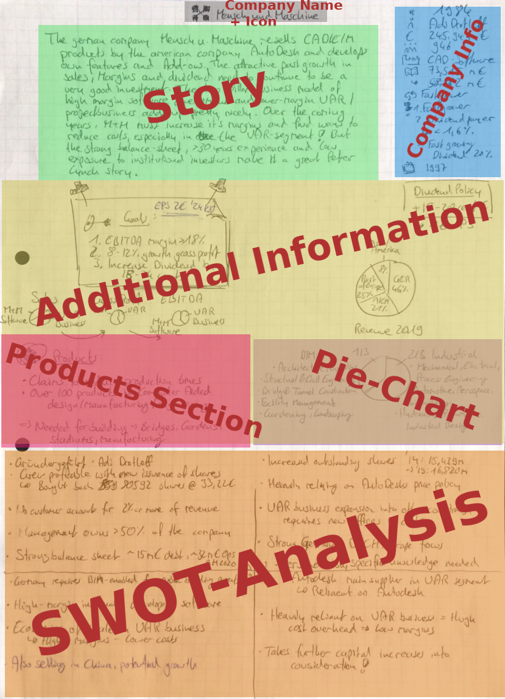

# Investment sheet as LaTeX
LaTeX template for an investment thesis for companies


# Goal
Have a reusable LaTeX tempalte (class file) with key details, SWOT-analysis and general information of a company. The handwritten example can be seen below.
All the sections need to be included in the LaTeX Tempalte.




## Usage with VS Code
- Install the Extensions
`Remote - Containers` by Microsoft
`LaTeX Workshop` by James Yu

- Open Settings with `CTRL + SHIFT + P` and select `Open Settings (JSON)` and add:
```json
{
    // ... YOUR OTHER SETTINGS ...    // latex
    "latex-workshop.docker.enabled": true,
    "latex-workshop.latex.outDir": "./out",
    "latex-workshop.synctex.afterBuild.enabled": true,
    "latex-workshop.view.pdf.viewer": "tab",
    "latex-workshop.docker.image.latex": "tianon/latex",
    // End
  }
```

1. Use `docker pull tianon/latex`

Now use the TEX_button on the left side to `View LaTeX PDF`


# Elements
Simple reusable commands for LaTeX environment
- Company Title
- Story
- Company Infosection
- Additional Information containing, `Products` and `Piechart` template.
- SWOT-Analysis

# ToDos LaTeX
- [ ] When ommiting a value, put three dashes (---)
- [ ] Parametrize the Questions enumerate section in the company infosection
- [ ] Template for Special-note (looks like 3M Post-it)
- [ ]

### Finished
- [X] Add a little bit more space between Header and the text below
- [X] Reduce the space between enumerate rows
- [X] Reduce the space between itemize rows
- [X] In the General-Information section aligne all the symbols on one line vertically
- [X] Add a second page
- [X] Move the "products" section beneath the Company story section
- [X] Reduce the indentation of the enumerate in the "reasons ?" section in the General-Information section
- [X] Reduce the borders of the page to (t,r,b,l) 1cm, 1cm, 1cm, 1.5cm
- [X] Remove the page number
- [X] Remove the "Figure 1:" standar caption from a chart caption
- [X] Create class file
- [X] Add required structure minimum
- [X] Tempalte for piecharts
- [X] Template for SWOT
- [X] Segment and use classes for the individual elements on the page (Header, Infosection, Piecharts, Story, S W O and T of the analysis, etc.)


# ToDos Webdev
- [ ] Build application that can write LaTeX
- [ ]

